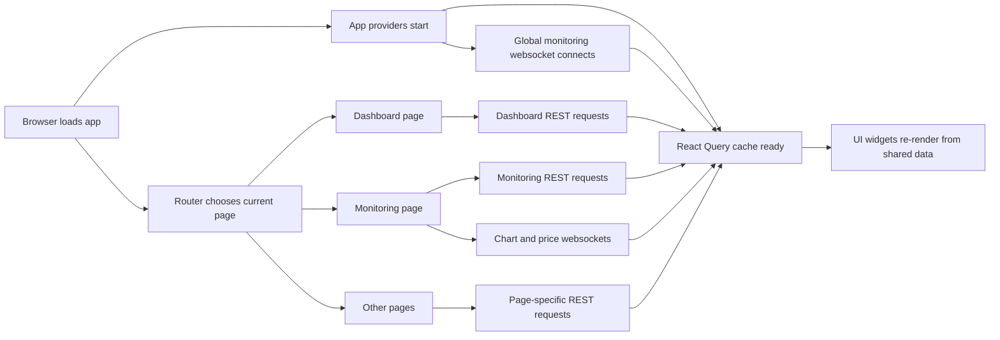
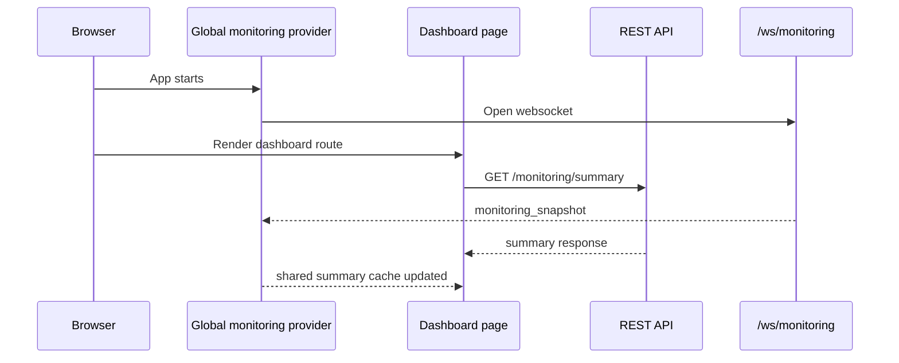
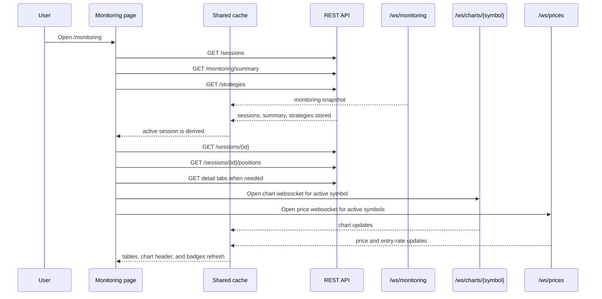
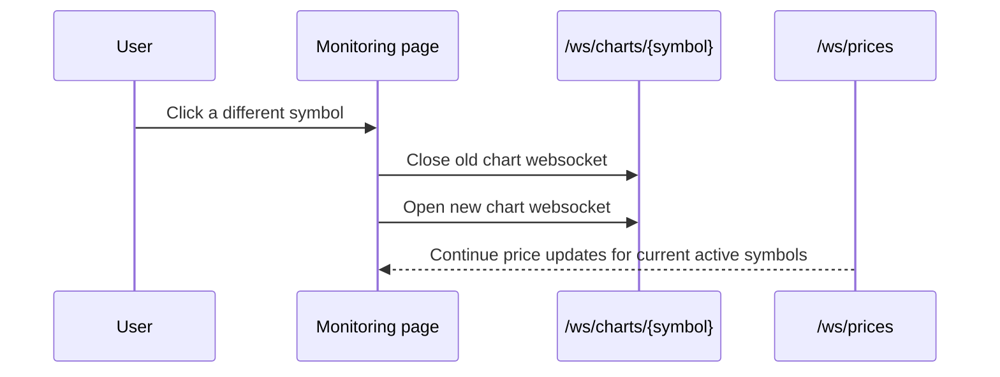
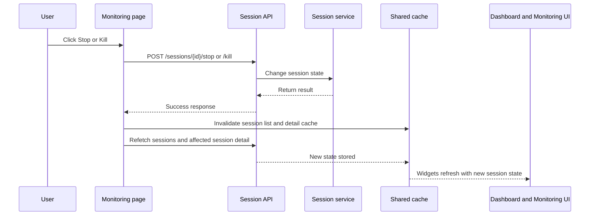

# NETWORK_FLOW_PLAYBOOK.md

## Document Info
- Product: Coin Lab
- Purpose: Explain the current network connection flow, page landing sequence, and UI impact in plain language.
- Audience: Maintainers, AI agents, and developers who need to change dashboard, monitoring, session, or realtime data behavior.
- Status: Draft
- Created: 2026-03-14

## Why This Document Exists
This project mixes one-shot API requests and long-lived realtime connections.

That makes simple UI changes risky:
- A page can depend on more than one API call.
- A single websocket update can refresh multiple widgets at once.
- A session mutation can change downstream requests, selected symbols, and chart connections.

Use this document before changing:
- page landing behavior
- websocket ownership or reconnect rules
- React Query cache updates or invalidation
- session selection or symbol selection logic
- dashboard and monitoring widgets that share data

If your change affects any of the flows below, update this document in the same change.

## Core Ideas

### 1. There are two network styles
- REST request: fetch now, then stop
- WebSocket: connect once, keep receiving updates

### 2. Most screens read from shared client-side cache
The frontend stores fetched data in React Query cache. Different widgets can read the same cached result.

This means one incoming update can refresh multiple visible sections at once.

### 3. Not every realtime connection is global
- The monitoring summary websocket is global.
- Chart and price websockets are page-scoped and selection-scoped.

### 4. Runtime lag is handled defensively
- The runtime now treats websocket receive time and market event time separately.
- Session freshness still uses market event time.
- When trade ticks arrive far behind real receive time, the runtime drops those lagged ticks instead of replaying a large stale backlog.
- Repeated stale-snapshot skip logs are throttled to avoid turning a lag spike into a database write storm.

## System-Wide Startup Flow

## Connection Inventory

| Connection | Type | Owner | Main Consumers | Main Effect |
| --- | --- | --- | --- | --- |
| `/api/v1/monitoring/summary` | REST | Page query | Dashboard, Monitoring | Bootstraps monitoring summary and provides fallback snapshot |
| `/ws/monitoring` | WebSocket | Global provider | Dashboard, Monitoring | Pushes summary updates into shared cache |
| `/api/v1/sessions` | REST | Monitoring page | Monitoring | Builds session list and decides active session |
| `/api/v1/sessions/{id}` | REST | Monitoring page | Monitoring | Fills selected session header, top status, and realized symbol PnL summaries |
| `/api/v1/sessions/{id}/positions` | REST | Monitoring page | Monitoring | Drives position table and open-position mark-to-market values inside symbol PnL rows |
| `/api/v1/sessions/{id}/signals` | REST | Monitoring page | Monitoring | Drives the `Signals` tab and the selected `Strategy Explain` detail |
| `/api/v1/sessions/{id}/orders` | REST | Monitoring page | Monitoring | Drives the `Orders` tab and supplies execution results joined into the `Signals` tab |
| `/api/v1/sessions/{id}/risk-events` | REST | Monitoring page | Monitoring | Drives the `Risk` tab and explains blocked rows inside the `Signals` tab |
| `/api/v1/logs/strategy-execution` | REST | Monitoring page | Monitoring | Drives event log tab |
| `/ws/charts/{symbol}` | WebSocket | Monitoring page | Monitoring | Updates the center chart for the active symbol only |
| `/ws/prices?symbols=...` | WebSocket | Monitoring page | Monitoring | Updates live prices, symbol PnL rows, and recent buy/sell entry-rate badges |
| `/ws/backtests/{run_id}` | WebSocket | Backtests flow | Backtests | Streams backtest progress only |

## Scenario 1: Dashboard Landing
The dashboard is mostly a shared summary screen.

### Sequence

### UI Impact
One summary payload can refresh many dashboard widgets together:
- status chips
- running session count
- active symbol count
- seven-day return card
- risk alert list
- recent signal list
- strategy-detail entry readiness percentages

Dashboard note:
- The dashboard strategy cards now read strategy-specific entry readiness from the shared monitoring summary payload.
- They do not open a separate `/ws/prices` connection just to render buy/sell percentages.

### Maintenance Note
If a dashboard widget changes data source, update this document and the monitoring summary dependency list.

## Scenario 2: Monitoring Page Landing
This is the heaviest data-loading page in the app.

### Sequence

### What Depends On What
- `sessions` must load before the page can reliably choose the active session.
- The active session must exist before detail requests can run.
- Active symbols come from the selected session.
- Realized symbol PnL now comes from the selected session's `performance.symbol_performance`.
- Open-position mark-to-market still comes from `/sessions/{id}/positions` plus `/ws/prices`.
- The active symbol must exist before the chart websocket opens.
- The `Signals` tab needs `signals`, `orders`, and `risk-events` together to explain whether a signal filled, was blocked, or has no linked order.
- The `Orders` tab can render from `/orders` alone, but still reuses the signal-to-order match result to show linked signal context when available.
- `/ws/prices` now carries both the latest trade price and a rolling one-minute buy/sell entry-rate snapshot per symbol.

### UI Impact
This page combines:
- shared monitoring summary
- session-level detail
- tab-specific detail
- chart realtime data
- live prices
- symbol-level buy/sell entry-rate snapshots derived from recent trade flow
- signal selection state for `Strategy Explain`
- a `Signals` table that joins signals with downstream orders and risk blocks
- a separate `Orders` table for runtime order states

Because of that, a bug here can look like:
- empty chart
- wrong selected symbol
- stale session header
- log tab showing no data
- repeated websocket reconnects
- `Strategy Explain` showing the wrong signal after a row click or chart marker click

## Scenario 3: Selecting a Symbol on the Monitoring Page
Selecting a symbol changes the focus inside the current session. It is not a full system-wide change.

### Sequence

### UI Impact
Usually changes:
- center chart
- selected symbol highlight
- live price, entry-rate, and PnL rows related to that symbol

Usually does not change:
- running session count
- dashboard summary cards
- session status
- strategy group selection

### Marker Click Note
Signal markers on the chart do not open a new network connection.

Current behavior:
- marker rendering uses the already-fetched `/api/v1/sessions/{id}/signals` result
- clicking a marker or a `Signals` row updates local selected-signal state only
- the right-side `Strategy Explain` tab opens for that selected signal

### Maintenance Note
If symbol selection starts changing global summary data, document that explicitly. That would be a behavior shift.

## Scenario 4: Stopping or Killing a Session
This is a structural change, not just a view change.

### Sequence

### UI Impact
Can change:
- running session count
- active session status chip
- available symbols
- positions table
- orders, signals, risk events, and logs for that session
- dashboard status chips
- monitoring top bar

### Hidden Side Effects
If the stopped session was the current active session:
- active symbols may become empty
- chart websocket may close because there is no active symbol
- price websocket may reconnect with a smaller symbol set or no symbol set

## Global vs Local Impact Rules

### Global impact changes
These can affect more than one page at once:
- monitoring summary websocket payload shape
- monitoring summary cache key or update logic
- session mutation invalidation rules
- active session derivation rules

### Local impact changes
These usually affect only a focused area:
- selected symbol change
- chart timeframe change
- chart overlay toggles
- tab-local polling enable or disable rules

## Current Websocket Ownership Model
- One global monitoring websocket owned by the app provider
- One chart websocket owned by the monitoring page hook
- One price websocket owned by the monitoring page hook
- One backtest websocket owned by the backtest flow

If websocket ownership moves between global and page scope, update this document. That change alters reconnect behavior, page transitions, and possible duplicate connections.

## Files To Read Before Changing These Flows
- [frontend/src/main.tsx](../frontend/src/main.tsx)
- [frontend/src/app/providers.tsx](../frontend/src/app/providers.tsx)
- [frontend/src/pages/DashboardPage.tsx](../frontend/src/pages/DashboardPage.tsx)
- [frontend/src/pages/MonitoringPage.tsx](../frontend/src/pages/MonitoringPage.tsx)
- [frontend/src/features/monitoring/api.ts](../frontend/src/features/monitoring/api.ts)
- [frontend/src/features/monitoring/useMonitoringSummaryStream.ts](../frontend/src/features/monitoring/useMonitoringSummaryStream.ts)
- [frontend/src/features/monitoring/useChartStream.ts](../frontend/src/features/monitoring/useChartStream.ts)
- [frontend/src/features/monitoring/useActiveSymbolPrices.ts](../frontend/src/features/monitoring/useActiveSymbolPrices.ts)
- [frontend/src/features/sessions/api.ts](../frontend/src/features/sessions/api.ts)
- [frontend/src/features/logs/api.ts](../frontend/src/features/logs/api.ts)
- [backend/app/api/routes/monitoring.py](../backend/app/api/routes/monitoring.py)
- [backend/app/api/routes/sessions.py](../backend/app/api/routes/sessions.py)
- [backend/app/api/ws_router.py](../backend/app/api/ws_router.py)
- [backend/app/application/services/monitoring_service.py](../backend/app/application/services/monitoring_service.py)

## Required Update Triggers
Update this document when a change does any of the following:
- adds, removes, or renames a REST endpoint used by dashboard or monitoring
- adds, removes, or renames a websocket route
- changes which page owns a websocket connection
- changes page landing order or which request starts first
- changes session selection or symbol selection rules
- changes which widgets depend on monitoring summary
- changes cache invalidation after session create, stop, or kill
- changes reconnect behavior or disconnect handling

## Short Review Checklist
Before merging network-flow-related changes, confirm:
- Which page opens which connection?
- Is the connection global or page-scoped?
- Which widgets update from that data?
- Does a mutation invalidate every cache that depends on it?
- Does this document still match the implementation?
